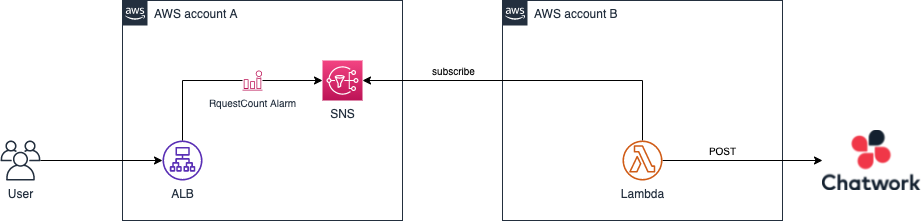

# CloudWatch AlarmをクロスアカウントなLambdaからChatworkへ飛ばしたい

異なるAWSアカウントのSNS Topicをサブスクライブして、ChatworkへCloudWatch Alarmを通知するための手順と環境構築手順です。

<br>

## 概要

今回は以下のようなケースを想定しています。

<br>



<br>

サービスを稼働させているアカウントAから、システム管理用アカウントBに対してCloudWatchメトリクスの閾値超過のアラームを転送し、Chartworkへ転送します。
Lambdaがサブスクライブする対象Topicを増加させば、複数のサービスアカウントを統合的にアカウントBで処理可能です。

通知対象としているAlarmはALBのRequest Countメトリクスですが、CloudWatch上でAlarmとして設定できるものであれば何でも良いです。

<br>

## 手順の流れ

手順全体の大まかな流れは以下のようになります。

### アカウントA

1. CloudWatch Alarmを作成（手動）
2. SNS Topicを作成しクロスアカウント権限を付与（手動）

### アカウントB

3. SAMで環境構築

<br>

## SAMについて

今回はアカウントB環境をSAMを使って簡単に構築していきます。
[テンプレート](./template.yaml)の中身（```Description```や```FunctionName```など）や、[Lambda関数](./push_chatwork.py)で送信するメッセージ表記は適宜変更して下さい。

尚、AWS SAM CLIの実行環境構築などは紹介していないため、詳しい手順については[公式サイト](https://docs.aws.amazon.com/ja_jp/serverless-application-model/latest/developerguide/serverless-sam-cli-install.html)を参照して下さい。

<br>

## 構築手順

ほげ